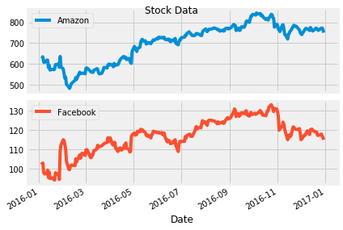

# Risk and Returns: The Sharpe Ratio
_Calculating the Sharpe Ratio for the stocks of Facebook and Amazon_

The Sharpe ratio compares the **expected returns** for two investment opportunities and calculates the **additional return per unit of risk** an investor could obtain by choosing one over the other. 
In particular, it looks at the difference in returns for two investments and compares the average difference to the **standard deviation** (as a measure of risk) of this difference. 
A higher Sharpe ratio means that the reward will be higher for a given amount of risk. 
It is common to compare a specific opportunity against a **benchmark** that represents an entire category of investments.

The Sharpe ratio is usually calculated for a portfolio and uses the risk-free interest rate as benchmark. 
We will simplify our example and use stocks instead of a portfolio. We will also use a stock index as benchmark rather than the risk-free interest rate because both are readily available at daily frequencies and we do not have to get into converting interest rates from annual to daily frequency. 
Just keep in mind that you would run the same calculation with portfolio returns and your risk-free rate of choice, e.g, the 3-month Treasury Bill Rate.

## Data
As benchmark we'll use the S&P 500 that measures the performance of the 500 largest stocks in the US. 
When we use a stock index instead of the risk-free rate, the result is called the Information Ratio and is used to benchmark the return on active portfolio management because it tells you how much more return for a given unit of risk your portfolio manager earned relative to just putting your money into a low-cost index fund.

## Analysis
### Visualize daily prices for Amazon and Facebook

### Visualize daily values for the S&P 500

### Visualize Daily Stock Returns

### Visualize S&P 500 Returns

### Visualize Excess Returns
_Calculate the relative performance of stocks vs. the S&P 500 benchmark_

### The Sharpe Ratio, Step 1: The Average Difference in Daily Returns Stocks vs S&P 500
_Calculate the average of the excess returns - how much more or less the investment yields per day compared to the benchmark_

It looks like there was quite a bit of a difference between average daily returns for Amazon and Facebook.

### The Sharpe Ratio, Step 2: Standard Deviation of the Return Difference
_Calculate the standard deviation of the excess returns - the amount of risk an investment in the stocks implies as compared to an investment in the S&P 500_

### Calculate the sharpe ratio
The Sharpe Ratio is often **annualized** by multiplying it by the square root of the number of periods. 
We have used daily data as input, so we'll use the square root of the number of trading days (5 days, 52 weeks, minus a few holidays): √252

In 2016, Amazon had a Sharpe ratio twice as high as Facebook. 
This means that an investment in Amazon returned twice as much compared to the S&P 500 for each unit of risk an investor would have assumed. 
In other words, in risk-adjusted terms, the investment in Amazon would have been more attractive.

This difference was mostly driven by differences in return rather than risk between Amazon and Facebook. 
The risk of choosing Amazon over FB (as measured by the standard deviation) was only slightly higher so that the higher Sharpe ratio for Amazon ends up higher mainly due to the higher average daily returns for Amazon.

