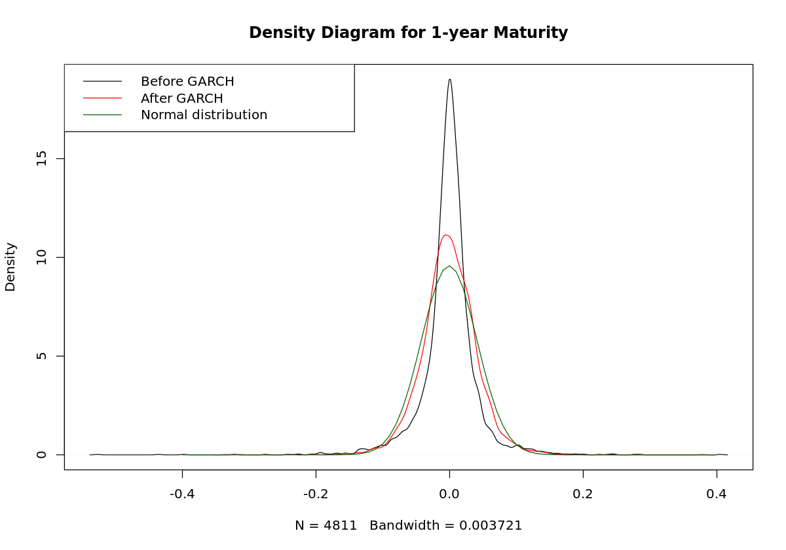

# Modeling The Volatility Of Us Bond Yields
_Build a model to study the nature of volatility in the case of US government bond yields_

  

## Objective
Financial risk has many faces, and we measure it in many ways, but for now, let's agree that it is a measure of the possible loss on an investment. In financial markets, where we measure prices frequently, volatility (which is analogous to standard deviation) is an obvious choice to measure risk. But in real markets, volatility changes with the market itself.

## Analysis
### Evolution of Bond Yields
The yield of a bond is the price of the money lent. The higher the yield, the more money you receive on your investment. The yield curve has many maturities; in this case, it ranges from 1 year to 30 years. Different maturities have different yields, but yields of neighboring maturities are relatively close to each other and also move together.

We can see that the long yields (e.g. SVENY30) tend to be more stable in the long term, while the short yields (e.g. SVENY01) vary a lot. These movements are related to the monetary policy of the FED and economic cycles.

- The direction (positive or negative) of a return is mostly independent of the previous day's return. In other words, you don't know if the next day's return will be positive or negative just by looking at the time series.
- The magnitude of the return is similar to the previous day's return. That means, if markets are calm today, we expect the same tomorrow. However, in a volatile market (crisis), you should expect a similarly turbulent tomorrow.

### Evolution of Votality
To understand how volatility evolves we have to examine the changes in the time series. We need to calculate the changes in the yield levels. This is called "differentiation" in time series analysis. Differentiation has the added benefit of making a time series **independent of time**.

We can see in the the bond yields of various maturities show similar but slightly different characteristics. These different characteristics can be the result of multiple factors such as the monetary policy of the FED or the fact that the investors might be different.

#### Test for Autocorrelation
Autocorrelation measures how a datapoint's past determines the future of a time series.
- If the autocorrelation is close to 1, the next day's value will be very close to today's value.
- If the autocorrelation is close to 0, the next day's value will be unaffected by today's value.

### GARCH
A Generalized AutoRegressive Conditional Heteroskedasticity (GARCH) model is the most well known econometric tool to handle changing volatility in financial time series data. It assumes a **hidden volatility** variable that has a long-run average it tries to return to while the short-run behavior is affected by the past returns.

The most popular form of the GARCH model assumes that the volatility follows this process:

where &sigma; is the current volatility, &sigma;t-1 the last day's volatility and &epsilon;t-1 is the last day's return. The estimated parameters are &omega;, &alpha;, and &beta;.

We can see that the 1-year GARCH model shows a similar but more erratic behavior compared to the 20-year GARCH model. Not only does the 1-year model have greater volatility, but the volatility of its volatility is larger than the 20-year model.

### Distributions
- The unconditional (before GARCH) distribution of the yield differences has heavier tails than the normal distribution.
- The distribution of the yield differences adjusted by the GARCH model has lighter tails than the unconditional distribution, but they are still heavier than the normal distribution.

