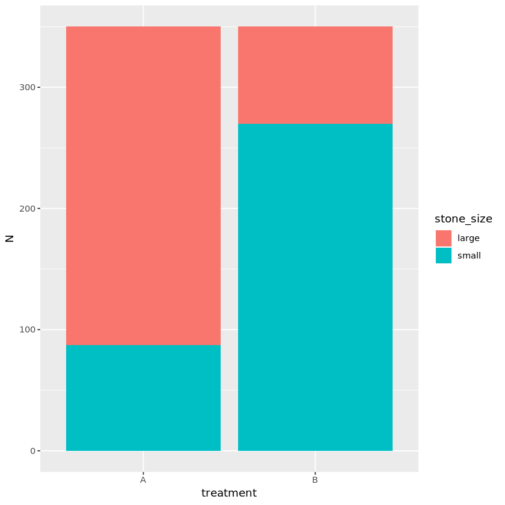
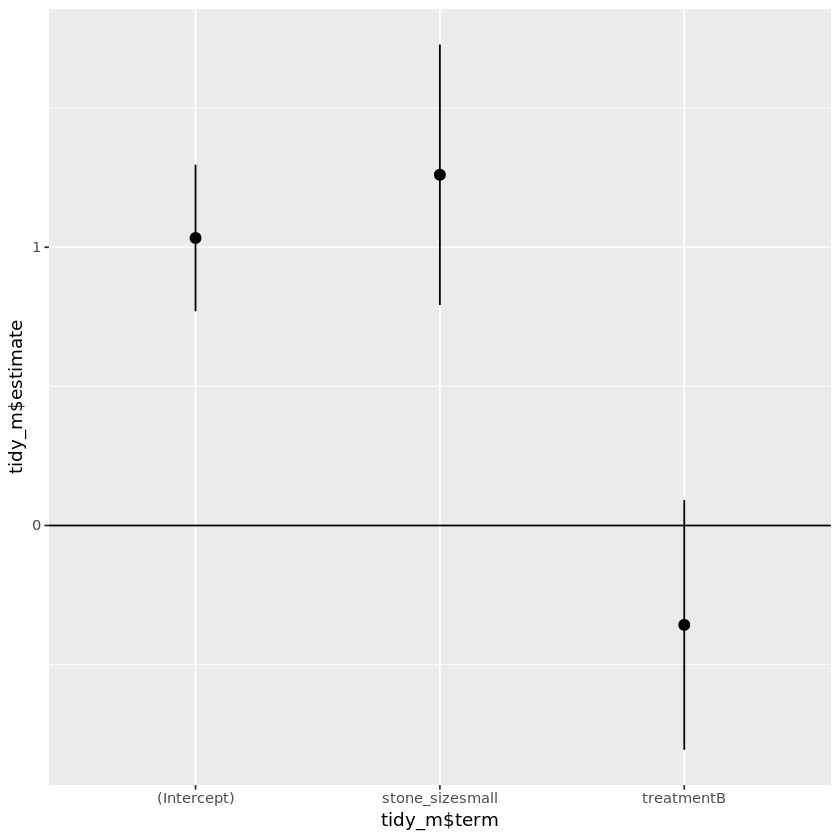

# Kidney Stone Treatment and Simpon's Paradox
_Explore Simpon’s paradox using multiple regression and other statistical tools_

## Objective

  

In 1986, a group of urologists in London published a research paper in <em>The British Medical Journal</em> that compared the effectiveness of two different methods to remove kidney stones. Treatment A was open surgery (invasive), and treatment B was percutaneous nephrolithotomy (less invasive). When they looked at the results from 700 patients, treatment B had a higher success rate. However, when they only looked at the subgroup of patients different kidney stone sizes, treatment A had a better success rate. What is going on here? This known statistical phenomenon is called Simpon’s paradox. Simpon's paradox occurs when trends appear in subgroups but disappear or reverse when subgroups are combined. 

This project will explore Simpon’s paradox using multiple regression and other statistical tools.

## Data
The data contains three columns: treatment (A or B), stone_size (large or small) and success (0 = Failure or 1 = Success). 
|treatment|stone_size|success|
|---|---|---|
|B|large|1|
|A|large|1|
|A|large|0|
|A|large|1|
|A|large|1|
|B|large|1|

## Analysis
### Recreate the Treatment X Success summary table

From the treatment and success rate descriptive table, we saw that treatment B performed better on average compared to treatment A (82% vs. 78% success rate).

|treatment|success|N|Freq|
|---|---|---|---|
|A|0|77|0.220|
|A|1|273|0.780|
|B|0|61|0.174|
|B|1|289|0.826|

### Bringing stone size into the picture

When stratified by stone size, treatment A had better results for both large and small stones compared to treatment B (i.e., 73% and 93% v.s. 69% and 87%).

|treatment|stone_size|success|N|Freq|
|---|---|---|---|---|
|A|large|0|71|0.270|
|A|large|1|192|0.730|
|A|small|0|6|0.069|
|A|small|1|81|0.931|
|B|large|0|25|0.312|
|B|large|1|55|0.688|
|B|small|0|36|0.133|
|B|small|1|234|0.867|

From the bar plot, we noticed an unbalanced distribution of kidney stone sizes in the two treatment options. 
Large kidney stone cases tended to be in treatment A, while small kidney stone cases tended to be in treatment B. 

### Identify and confirm the lurking variable

Let's analyze the association between stone size (i.e., case severity) and treatment assignment using a statistical test called <strong>Chi-squared</strong>. 
The <strong>Chi-squared</strong> test is appropriate to test associations between two categorical variables.

  
With the results, we are confident that stone size/case severity is indeed the lurking variable (aka, confounding variable) in this study of kidney stone treatment and success rate.

|statistic|p.value|parameter|method|
|---|---|---|---|
|189.3557|4.395009e-43|1|Pearson's Chi-squared test with Yates' continuity correction|

### Remove the confounding effect
In our example, we are testing to see:

<ol>
<li>if the effect of a small stone is the same as a big stone, and </li>
<li>if treatment A is as effective as treatment B. </li>
</ol>

Let's use multiple logistic regression to remove the unwanted effect of stone size

|term|estimate|std.error|statistic|p.value|
|---|---|---|---|---|
|(Intercept)|1.0332140|0.1344695|7.683629|1.546436e-14|
|stone_sizesmall|1.2605654|0.2390027|5.274272|1.332838e-07|
|treatmentB|-0.3572287|0.2290792|-1.559411|1.188991e-01|

Look at the 95% confidence interval:

From the model output, we can conclude that the stone size is positively related to the success rate while the treatment type is not.
