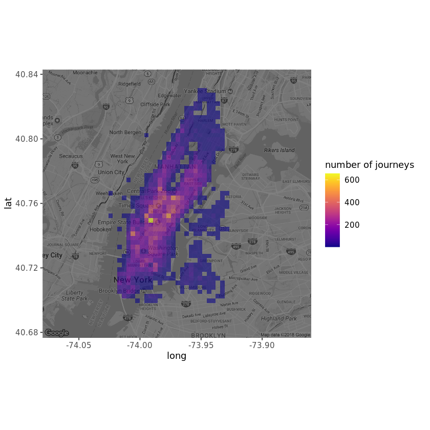
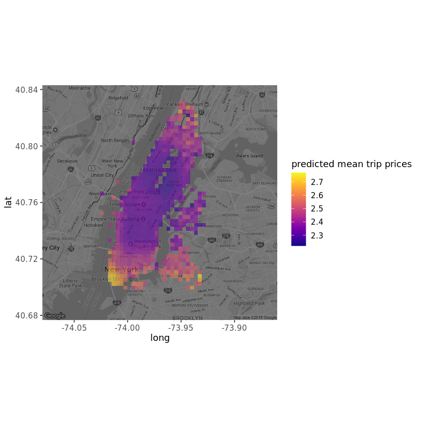
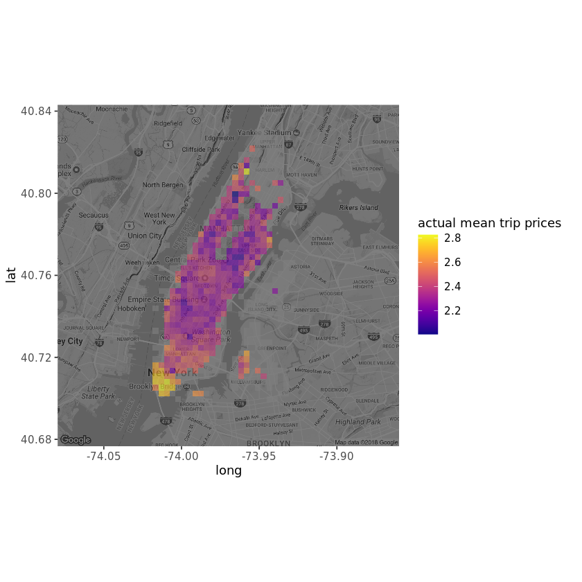

# Predicting Taxi Fares with Random Forests
_Build a model that can predict the locations and times when the biggest fares can be earned_

  

## Objective
To drive a yellow New York taxi, you have to hold a "medallion" from the city's Taxi and Limousine Commission. Recently, one of those changed hands for over one million dollars, which shows how lucrative the job can be.

But this is the age of business intelligence and analytics! Even taxi drivers can stand to benefit from some careful investigation of the data, guiding them to maximize their profits. In this project, we will analyze a random sample of 49999 New York journeys made in 2013. We will also use regression trees and random forests to build a model that can predict the locations and times when the biggest fares can be earned.

## Data
The taxi dataset contains the times and price of a large number of taxi trips. Importantly we also get to know the location, the longitude and latitude, where the trip was started.
|medallion|pickup_datetime|pickup_longitude|pickup_latitude|trip_time_in_secs|fare_amount|tip_amount|
|---|---|---|---|---|---|---|
|4D24F4D8EF35878595044A52B098DFD2|2013-01-13 10:23:00|-73.94646|40.77273|600|8.0|2.5|
|A49C37EB966E7B05E69523D1CB7BE303|2013-01-13 04:52:00|-73.99827|40.74041|840|18.0|0.0|
|1E4B72A8E623888F53A9693C364AC05A|2013-01-13 10:47:00|-73.95346|40.77586|60|3.5|0.7|

## Analysis
### Where does the journey begin?
The map from the previous task showed that the journeys are highly concentrated in the business and tourist areas. We also see that some taxi trips originating in Brooklyn slipped through.

### Predicting taxi fares using a tree
We're now going to use a regression tree to predict the total fare with lat and long being the predictors. The tree algorithm will try to find cutpoints in those predictors that results in the decision tree with the best predictive capability.

The tree above looks a bit frugal, it only includes one split: It predicts that trips where lat < 40.7237 are more expensive, which makes sense as it is downtown Manhattan.

### Fitting a Random Forest Model
A random forest model, where many different trees are fitted to subsets of the data, may well include the other variables in some of the trees that make it up.

The model built explain only about 3% of the variance.

Looking at the map above with the predicted fares we see that fares in downtown Manhattan are predicted to be high, while midtown is lower. 

When comparing the map with the predicted fares with a new map showing the mean fares according to the data, it looks like the random forest model captured some of the patterns in our data.

