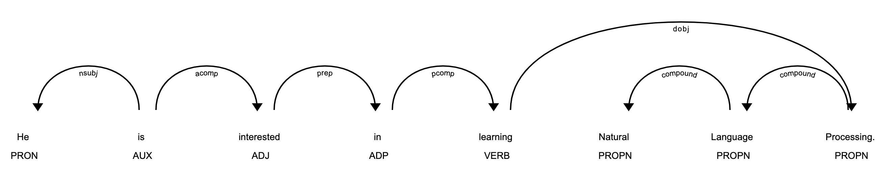
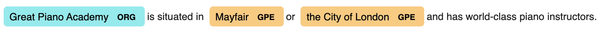

# Natural Language Processing With spaCy
This project utilized spaCy to explore different Natural Language Processing tasks on text

## Tasks Covered
**1. Sentence Detection**

**2. Tokenization**

Identify the basic units in the text

**3. Remove Stop Words**

**4. Lemmatization**

Reducing inflected forms of a word. The reduced form or root word is called a lemma.

**5. Calculate Word Frequency**

**6. Part of Speech Tagging**

There are eight <a href="https://spacy.io/api/annotation#pos-tagging">parts of speech</a>

**7. Rule-Based Matching**

Identify and extract tokens and phrases according to patterns (such as lowercase) and grammatical features (such as part of speech).

**8. Dependency Parsing**

Defines the dependency relationship between headwords and their dependents. The verb is usually the head of the sentence.

**9. Shallow Parsing/Chuncking**

Groups adjacent tokens into phrases on the basis of their POS tags. There are some standard well-known chunks such as noun phrases, verb phrases, and prepositional phrases.
- Noun Phrase: has a noun as its head. Help infer what is being talked about in the sentence.
- Verb Phrase: has at least one verb. Help understand the actions of the nouns. Requires textacy package

**10. Named Entity Recognition (NER)**

Locating named entities in text and classifying them into pre-definfed categories: person names, organizations, locations, etc.
