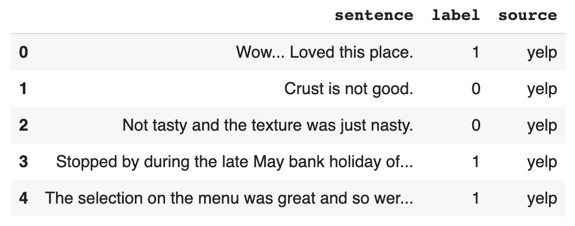

# Reviews Sentiment Classification With Keras

### Data
--------------------
<a href="https://archive.ics.uci.edu/ml/datasets/Sentiment+Labelled+Sentences">Sentiment Labelled Sentences Data Set</a> from the UCI Machine Learning Repository

### Tasks
----------------------
- Baseline model: bag-of-word model with Logistic Regression
  <ol>
    <li>Vectorize sentences: takes words and creates a vocabulary of unique words</li>
    <li>Create bag of words model by representing each document as a vector</li>
    <li>Build a logistic regression model with `label` field as the y variable and bag of words vectors as the x variable</li>
  </ol>
- Keras neural networks model
  <ol>
    <li>Use a ReLU function for hidden layers, a sigmoid function for the output layer</li>
  </ol>

- Convolutional neural networks

- Hyperparameters Optimization
