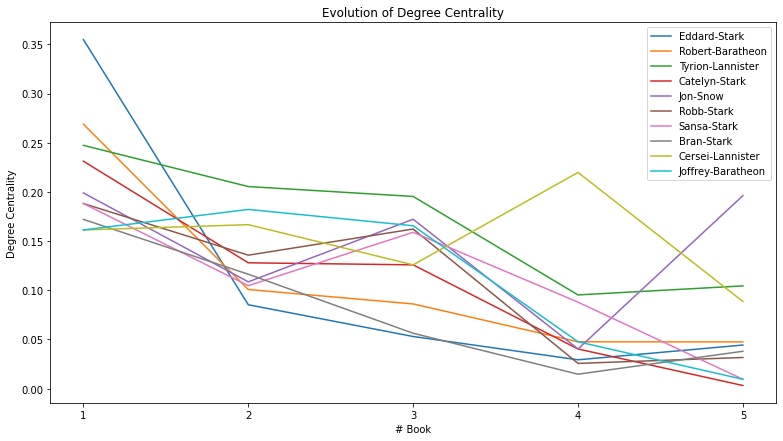
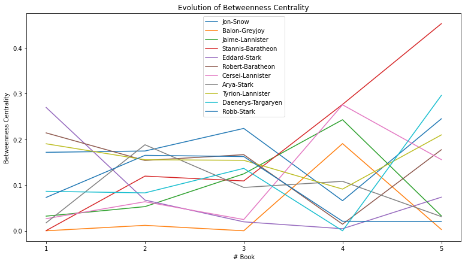
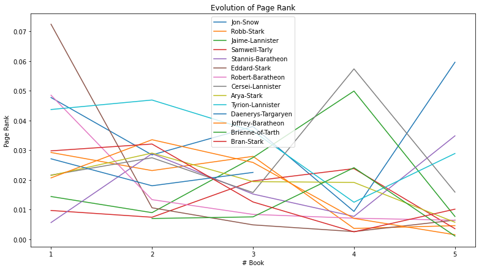

# A Network Analysis of Game of Thrones
_Analyze the co-occurrence of the characters in the Game of Thrones_

Game of Thrones is the hugely popular television series by HBO based on the (also) hugely popular book series <em>A Song of Ice and Fire</em> by George R.R. Martin. This project will analyze the co-occurrence network of the characters in the Game of Thrones books. Two characters are considered to co-occur if their names appear in the vicinity of 15 words from one another in the books. 

## Data

The dataset constitutes a network and is given as a text file describing the <em>edges</em> between characters, with some attributes attached to each edge.

|Source|Target|Type|weight|book|
|---|---|---|---|---|
|0|Addam-Marbrand|Jaime-Lannister|Undirected|3|1|
|1|Addam-Marbrand|Tywin-Lannister|Undirected|6|1|
|2|Aegon-I-Targaryen|Daenerys-Targaryen|Undirected|5|1|
|3|Aegon-I-Targaryen|Eddard-Stark|Undirected|4|1|
|4|Aemon-Targaryen-(Maester-Aemon)|Alliser-Thorne|Undirected|4|1|

The DataFrames have 5 columns: <code>Source</code>, <code>Target</code>, <code>Type</code>, <code>weight</code>, and <code>book</code>. Source and target are the two nodes that are linked by an edge. A network can have directed or undirected edges and in this network all the edges are <bold>undirected</bold>. The weight attribute of every edge tells us the number of <bold>interactions</bold> that the characters have had over the book, and the book column tells us the book number.

## Analysis

We will use <code>networkx</code>, a network analysis library, and create a graph object for the first book.

### Degree Centrality
The importance of a node in a network can be measured by looking at the number of neighbors it has, that is, the number of nodes it is connected to. This measure of importance is called degree centrality.

According to degree centrality, the most important character in the first book is Eddard Stark but he is not even in the top 10 of the fifth book.

By looking at the evolution of degree centrality of characters who showed up in the top 10 of degree centrality in the first book - we can see that the importance of Eddard Stark dies off as the book series progresses. With Jon Snow, there is a drop in the fourth book but a sudden rise in the fifth book.

## Betweenness Centrality
Betweenness centrality measures the extent to which a vertex lies on paths between other vertices. Vertices with high betweenness may have considerable influence within a network by virtue of their control over information passing between others.

By looking at the evolution of the Betweenness Centrality the top four characters of every book, we can see a peculiar rise in the importance of Stannis Baratheon over the books. In the fifth book, he is significantly more important than other characters in the network, even though he is the third most important character according to degree centrality.

## Page Rank
PageRank was the initial way Google ranked web pages. It evaluates the inlinks and outlinks of webpages in the world wide web, which is, essentially, a directed network.

Stannis, Jon Snow, and Daenerys are the most important characters in the fifth book according to PageRank.

## Correlation between different measures
We see a high correlation between these three measures for our character co-occurrence network. So we've been looking at different ways to find the important characters in the Game of Thrones co-occurrence network.

|Page Rank|Betweenness Centrality|Degree Centrality|
|---|---|---|
|Page Rank|1.000000|0.793372|0.971493|
|Betweenness Centrality|0.793372|1.000000|0.833816|
|Degree Centrality|0.971493|0.833816|1.000000|

## Most important characters in the fifth book
- The character that has the highest Page Rank is: Jon-Snow
- The character that has the highest Betweenness Centrality is: Stannis-Baratheon
- The character that has the highest Degree Centrality is: Jon-Snow

