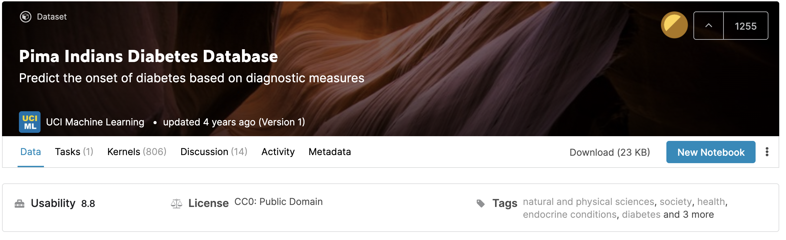
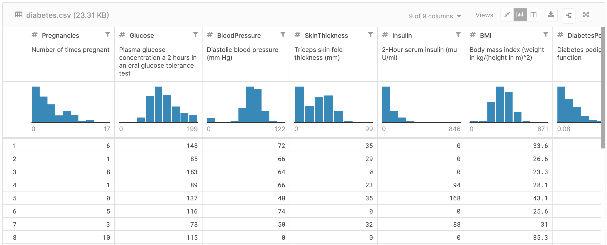

# Diabetes Prediction Models
Developed Diabetes Prediction Models with Logistic Regression, SVM, and Random Forest

Diabetes is one of the deadliest and chronic diseases. About one in seven U.S. adults has diabetes now. By 2050, as many as one in three may become diabetic. Many complications occur if diabetes remains untreated and unidentified. Identifying patients who are at high-risk of becoming diabetic allows early medical interventions.

## Data
[Pima Indians Diabetes Database](https://www.kaggle.com/uciml/pima-indians-diabetes-database)

## Approaches
### Data Understanding
Plotting patients health metrics against the Outcome
1. Most patients don't have diabetes: need oversampling in modeling
2. Patients with diabetes may have more pregnancy times
3. Patients with diabetes may ingest more glucose
4. Patients with or without diabetes have similar distribution of blood pressure
5. Patients with diabetes may have slightly insulin
6. Patients with diabetes may have higher BMI
7. Patients with diabetes may have higher Diabetes Pedigree Function scores
8. Patients with diabetes may have higher ages

### Data Preparation
1. Check for nulls
2. Check correlation among variables
3. Scale numeric data

### Modeling
1. Logistic Regression
2. Logistic Regression with Grid Search CV
3. SVM
4. SVM with Grid Search CV
5. Random Forest

### Evaluation
The model with highest recall score, accuracy, and AUC is Random Forest. The accuracy of the model is 0.79. From the ROC curve, we can see that the model can identify the most positive data points - most diabetes patients, and the area under curve of the model is 0.7328.
