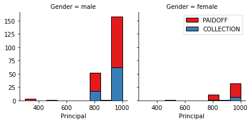
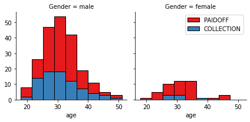
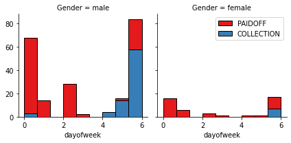

# Loan Repayment Prediction

## Data
This dataset is about past loans. The **Loan_train.csv** data set includes details of 346 customers whose loan are already paid off or defaulted. It includes following fields:

| Field          | Description                                                                           |
| -------------- | ------------------------------------------------------------------------------------- |
| Loan_status    | Whether a loan is paid off on in collection                                           |
| Principal      | Basic principal loan amount at the                                                    |
| Terms          | Origination terms which can be weekly (7 days), biweekly, and monthly payoff schedule |
| Effective_date | When the loan got originated and took effects                                         |
| Due_date       | Since it’s one-time payoff schedule, each loan has one single due date                |
| Age            | Age of applicant                                                                      |
| Education      | Education of applicant                                                                |
| Gender         | The gender of applicant                                                               |

## Data Visualization

1. 86 % of female pay there loans while only 73 % of males pay there loan

2. We see that people who get the loan at the end of the week dont pay it off, so lets use Feature binarization to set a threshold values less then day 4

## Modeling
Usinng the below algorithms to build a prediction model on the training set:
- K Nearest Neighbor(KNN)
- Decision Tree
- Support Vector Machine
- Logistic Regression

### Model Performance
| Algorithm	| Jaccard	| F1-score	| LogLoss	|
| --------- | ------- | --------- | ------- |
| KNN	| 0.67	| 0.65	| NA |
| Decision Tree	| 0.40	| 0.54	| NA |
| SVM	| 0.80	| 0.79	| NA |
| LogisticRegression	| 0.74	| 0.63	| 0.55 |
