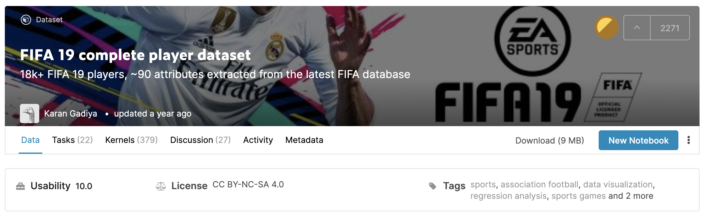
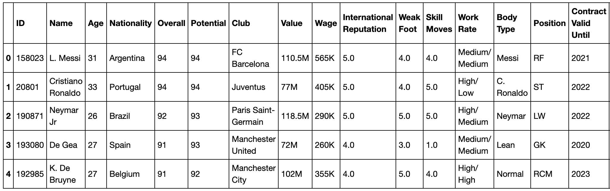

# Penalized Regression Models on FIFA Players Data
Use Penalized Regression Models to predict the overall scores of FIFA players

## Data
[FIFA 19 complete player dataset](https://www.kaggle.com/karangadiya/fifa19)

## Approaches
1. Fit simple regression model with cross validation to predict the overall score of a player
2. Fit a lasso regression model

Lasso penalizes the sum of their absolute values (L1 penalty). 

3. Fit a rigde- regression model

Ridge regression penalizes sum of squared coefficients (L2 penalty).

4. Fit a log- regression model
5. Tuning the alpha
6. Calculate Information Criterias  (AIC, BIC)
The lower the AIC & BIC, the better the model.
