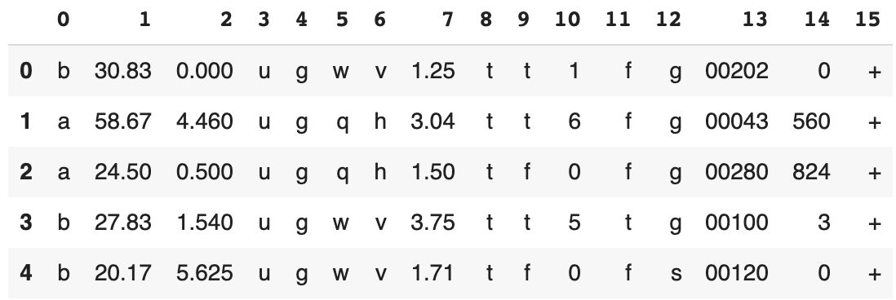

# Predicting Credit Card Approvals
_Automatic credit card approval predictor_

Commercial banks receive <em>a lot</em> of applications for credit cards. Many of them get rejected for many reasons, like high loan balances, low income levels, or too many inquiries on an individual's credit report, for example. Manually analyzing these applications is mundane, error-prone, and time-consuming (and time is money!). Luckily, this task can be automated with the power of machine learning and pretty much every commercial bank does so nowadays. This project builds an automatic credit card approval predictor using machine learning techniques, just like the real banks do.

## Data
[Credit Approval Data Set](http://archive.ics.uci.edu/ml/datasets/credit+approval) from UCI Machine Learning Repository

- The probable features in a typical credit card application are `Gender`, `Age`, `Debt`, `Married`, `BankCustomer`, `EducationLevel`, `Ethnicity`, `YearsEmployed`, `PriorDefault`, `Employed`, `CreditScore`, `DriversLicense`, `Citizen`, `ZipCode`, `Income` and finally the `ApprovalStatus`.
- The dataset contains both numeric and non-numeric data (specifically data that are of float64, int64 and object types). Specifically, the features 2, 7, 10 and 14 contain numeric values (of types float64, float64, int64 and int64 respectively) and all the other features contain non-numeric values
- The dataset also contains values from several ranges. Some features have a value range of 0 - 28, some have a range of 2 - 67, and some have a range of 1017 - 100000

## Approach
1. Handling the missing values
    - The missing values in the dataset are labeled with '?'
2. Preprocessing the data
    1. Convert the non-numeric data into numeric
    2. Feature Selection
    3. Split the data into train and test sets
    4. Scale the feature values to a uniform range
3. Fitting a logistic regression model and Making predictions
   - Accuracy of logistic regression classifier: ` 0.84`
4. Evaluating performance
5. Grid searching and making the model perform better
   - Grid search over the following two:
      - tol
      - max_iter  
      - Best score: 0.850725 using `{'max_iter': 100, 'tol': 0.01}`
