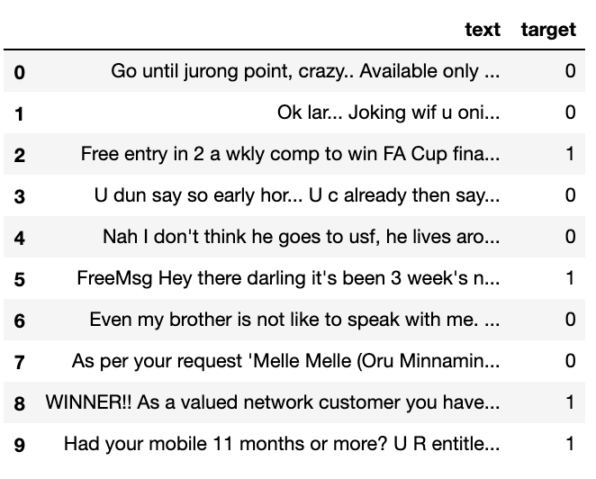
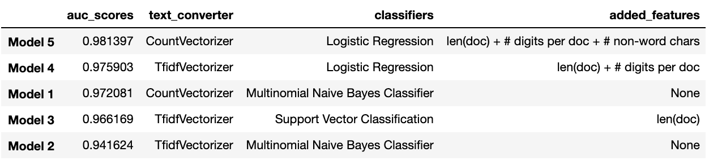

# Spam Email Detection
_Create models to predict if an email message is spam or not_

  

## Data
- The dataset contains 5572 messages, with 13.41% marked as spam message

## Data Exploration
- Finding 1: Spam message tends to be longer
- Finding 2: Spam message tends to have more digits
- Finding 3: Spam message tends to have more non-word characters

## Modeling
1. CountVectorizer & Multinomial Naive Bayes Classifier
2. TfidfVectorizer & Multinomial Naive Bayes Classifier
3. TfidfVectorizer & Support Vector Classification + Length of Document
4. TfidfVectorizer & Logistic Regression + Length of Document + # of digits per Document
5. CountVectorizer & Logistic Regression + + Length of Document + # of digits per Document + # of Non-word Characters

### Model Comparison
- The best model is Model 5

- Smallest coefficient in the model: ['..', '. ', ' i', ' go', 'pe', ' y', '? ', ' h', 'ok', 'go']
- Largest coefficient in the model: ['digit_count', 'co', 'ww', 'ne', 'ar', 'ia', 'xt', ' x', 'mob', ' ch']
