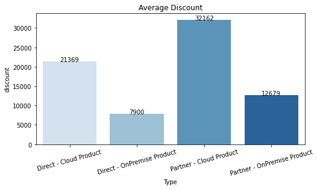
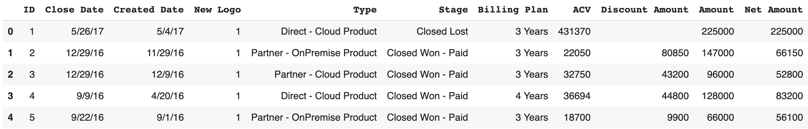
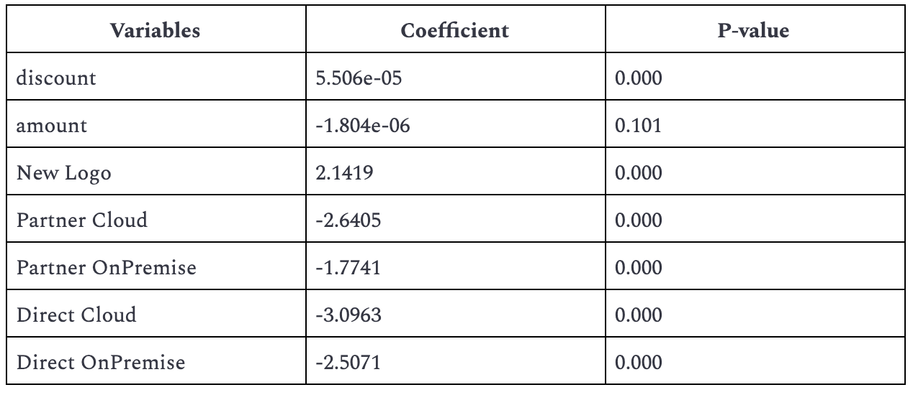
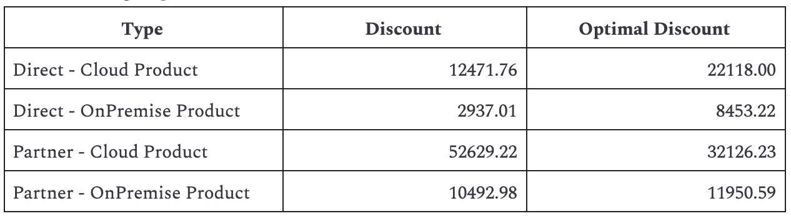
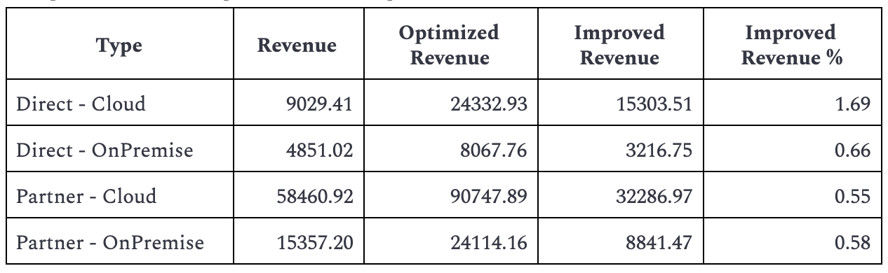

# Product Discount Optimization Model
This project developed a new discount strategy for the company’s four main products to improve the expected revenue. The strategy is developed based on the logistic regression and convex optimization model results.

Currently, the company has four focus products: Direct - Cloud, Direct - OnPremise, Partner - Cloud, and Partner - OnPremise, and each of the products has a different discount during different times. To increase the revenue from these four products, we need to dig more into our current discount strategy.

## Data
The data we performed the analysis included 1505 opportunities from Aug 3 to Aug 25, 2017. The analysis first split the data into the estimation sample and the holdout sample for modeling and evaluation respectively. The opportunities with ID from 1 to 1200 were selected as the estimation sample, and the opportunities with ID from 1200 to 1505 were selected as the holdout sample.

## Approaches
### Logistic Regression
We first used logistic regression to find out how the discount, price amount, and whether it is a New Logo of the opportunity, will affect its win probability. From the result we can see that the discount and a New Logo opportunity have a positive impact on winning the opportunity, while the price and product types have a negative impact on the win.

### Optimization Modeling
With the result of logistic regression, we were able to perform optimization modeling on the holdout sample to get the optimized discount for every opportunity. The average of the optimized discount for the holdout sample is 13,557 while the average of the actual discount is 12,685.

### Model Evaluation
To evaluate the performance of the logistic regression model, we calculated the expected revenue improvement over un-optimized discounts for leads in the hold-out sample for each product. From the result we can see that all four products improve their revenue with the model and the increase is most significant on the Direct - Cloud Product. We then evaluated the model by calculating the expected revenue improvement over un-optimized discounts for leads in the hold-out sample. From the result we can see that with optimized discounts, all four products have a higher optimized revenue, therefore, a higher improved revenue.

