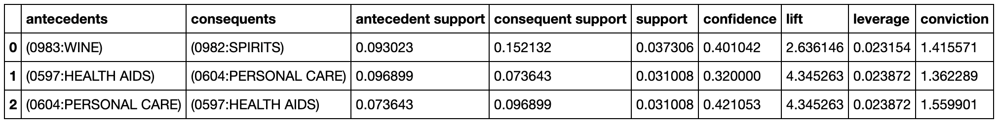
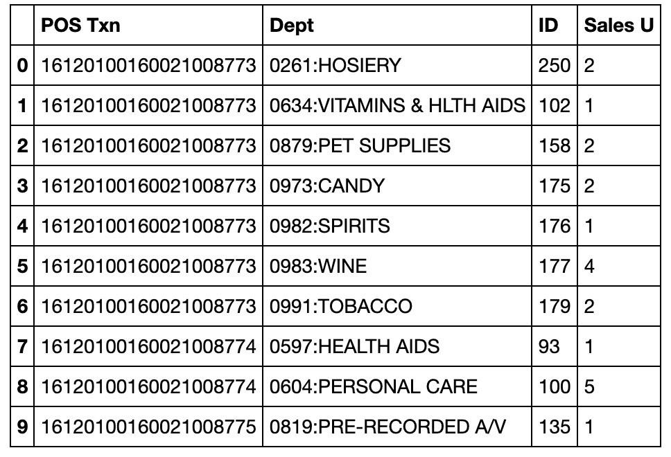

# Recommender System using Association Rule Mining
Generate frequent itemsets and association rules for a recommender system

## What is Association Rules

Rule generation is a common task in the mining of frequent patterns. An association rule is an implication expression of the form X→Y, where X and Y are disjoint itemsets.

## Metrics
Example of results:

1. support

Support is used to measure the **importance** of an itemset in a database. An itemset is a "frequent itemset" if the support is larger than a specified minimum-support threshold.

2. confidence

The confidence of a rule A->C is the probability of seeing the consequent in a transaction given that it also contains the antecedent. The confidence is 1 (maximal) for a rule A->C if the consequent and antecedent always occur together.

## Data

A simple dataset is provided [here](https://github.com/vanessaaleung/association-rules-generation/blob/master/transactions_by_dept.csv).

The data used in this project includes:

- transaction number
- item category
- sales unit

- items

## Approach
This project utilized the [Mlxtend](http://rasbt.github.io/mlxtend/) (machine learning extensions) to generate association rules from frequent itemsets.
