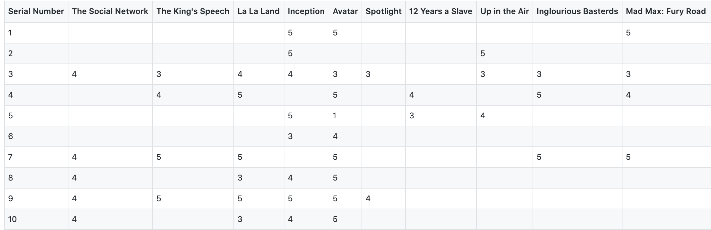

# Recomendation Systems for  Customer Analytics
Use collaborative filtering to build a movie recommendation system engine

## Data
A dataset of 5350 ratings from 99 users on 50 movies was given. 

## Approaches
We applied collaborative filtering techniques for different scenarios: 
1) predict ratings for existing customers; 
2) predict ratings for new customers and new movies; 
3) predict ratings for new customers after gaining their data.

We applied **cosine similarities** in **user-based** and **item-based** collaborative filtering, which allowed us to calculate similarities and used the most similar users/movies to predict target users/movies. For new users, we suggest using a generic recommendation approach and proactively gathering users’ demographic and preference information. For a new movie, we suggest promoting it to the audience who has liked movies that share similar attributes with the new movie or displaying the new movie on homepage and gather some useful data.

A robust recommendation system could increase customer engagement and satisfaction, retention rate and sales. Recommendation systems can also be used in other industries such as E-commerce. It could help prioritize items on websites and personalize product recommendations to encourage customers purchasing. 

## Limitation
To tackle the collaborative filtering’s limitation on sparse data and cold start users, we recommend using [**hybrid filtering**](https://en.wikipedia.org/wiki/Recommender_system#Hybrid_recommender_systems) or [**content-based filtering with neural networks architecture**](https://towardsdatascience.com/neural-collaborative-filtering-96cef1009401) to incorporate more features such as movie genres and user browsing histories. 

