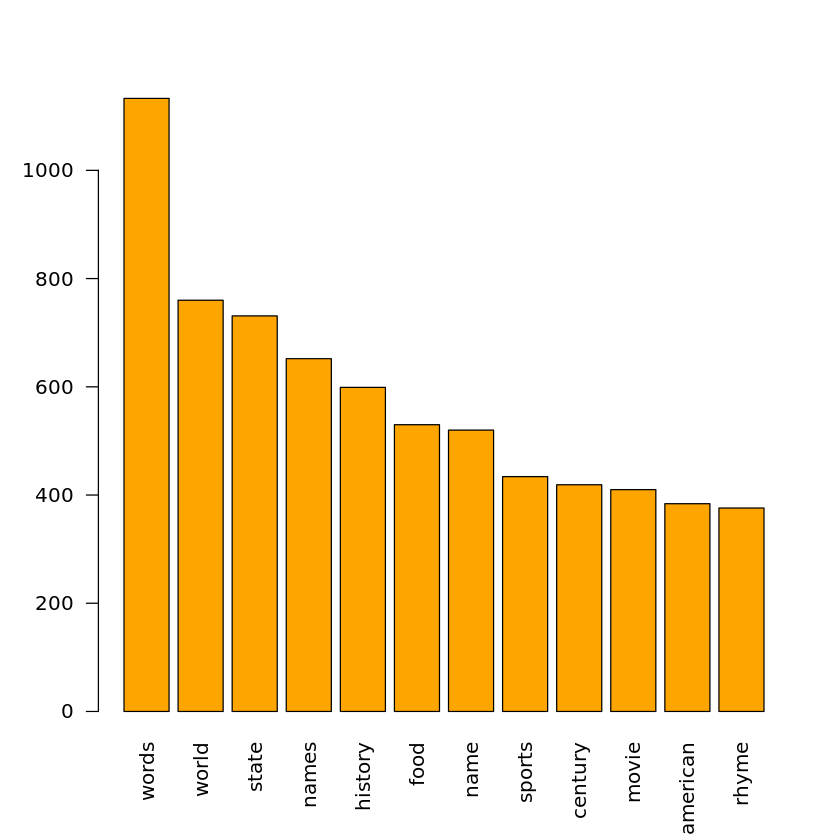
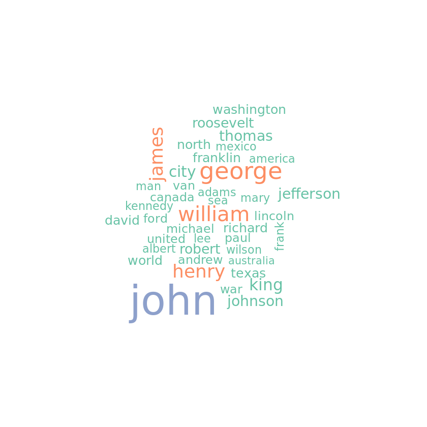

# Text Mining America's Toughest Game Show
_Spot trends in the types of questions asked in the game show_

## Objective

"This… is… <em>Jeopardy!</em>" These words will ring a bell for anyone who has watched the American game show, <em>Jeopardy!</em> . This iconic TV show could be described as quizbowl with gambling. In each 30-minute episode, three contestants compete in answering questions with specific monetary value, accumulating and wagering their earnings throughout each round. It's no petty cash, either; a recent <em>Jeopardy!</em> champion, James Holzhauer, walked away with $2.46 million after winning in 33 consecutive episodes. 

However, for an aspiring <em>Jeopardy!</em> champion, the amount of knowledge required to excel at the game might seem discouraging at first glance. How can it be possible to know everything about everything? Some <em>Jeopardy!</em> enthusiasts have turned to data analysis for the answers&mdash;and we'll do just that. This project will use basic text mining techniques on <em>Jeopardy!</em> data to spot trends in the types of questions asked.

## Data

Here are the basic rules of the game. Three contestants compete against each other in three rounds: <em><strong>Jeopardy</strong></em>, <em><strong>Double Jeopardy</strong></em>, and <em><strong>Final Jeopardy</strong></em>. In <em>Jeopardy</em> and <em>Double Jeopardy</em> , each round has six categories, with five answers per category. After an answer is read by the show's host, Alex Trebeck, each contestant competes to be the first to come up with the correct question to the answer. 

Each answer has a monetary value based on its difficulty. The monetary values in the <em>Double Jeopardy</em> round are double the values of the answers in <em>Jeopardy</em> round. In <em>Final Jeopardy</em>, the contestants bet any amount from their accumulated earnings on one difficult answer. 

For a complete breakdown of the rules, check out the <a href="https://en.wikipedia.org/wiki/Jeopardy!#Gameplay"><em>Jeopardy!</em> Wikipedia page</a>. Knowing the rules of the game will make the <code>jeopardy</code> dataset easier to understand!

|show_number|air_date|round|category|value|question|answer|
|---|---|---|---|---|---|---|
|4031|2/25/2002|Jeopardy!|AMERICAN HISTORY|$200|In 1805 this territory was created from the Indiana one, with all or parts of the lower & upper peninsulas|Michigan| 
|4031|2/25/2002|Jeopardy!|FIREFIGHTING|$200|The firefighting museum in Phoenix, Arizona isn't called the Hall of Fame, but the hall of this|the Hall of Flame|
|4031|2/25/2002|Jeopardy!|GEOGRAPH"E"|$200|Sicilians call this active volcano Mongibello|Etna|
|4031|2/25/2002|Jeopardy!|GIVE THE ROLE TO GARY|$200|TV, 1972-1979: Walter "Radar" O'Reilly|Gary Burghoff|
|4031|2/25/2002|Jeopardy!|WED TO THE IDEA|$200|The sacrament of marriage, it's "holy"|matrimony|
|4031|2/25/2002|Jeopardy!|CRIMINAL CONVERSATION|$200|Ice can refer to diamonds; chill can mean to do this, maybe with a lawnmower (a machine gun)|to kill|

## Analysis
### Favorite topics in the Jeopardy! round

Jeopardy! categories are notorious for being witty and unique. An example of a category title is "Element, Spel-ement" (from the episode aired on March 28, 2011). Every question in this category gave the contestant a list of chemical element names, and the contestant had to spell the word created by the symbols of those elements (example: boron, aluminum, potassium = "balk").

Some categories have more straightforward titles, such as the \"Indonesia\" category (from the episode on March 25, 2011), which had questions all about Indonesia.
A few of the top ranking category words are: "words," "world," "state," "name," and "history."

"Words" most likely refers to the wordplay or vocabulary categories, which appear often on the show. The other four words suggest that a Jeopardy! champion will need to know a lot about history, geography, and significant historical figures. However, when we go further down the plot, there's an interesting term—the 11th most common term is "American." Considering this is an American game show, it would make sense that the game requires the contestants to be most familiar with American history.

### Look at the answers to the Final Jeopardy round

<strong>Final Jeopardy</strong> is arguably the most important round in the entire game&mdash;contestants bet any amount from their accumulated earnings on one answer. This answer is supposedly more difficult than all the questions in the previous rounds. The contestants make their bets before the answer is read and are given 30 seconds to write down their questions. You can probably imagine how much of a game-changer this round is (check out <a href="https://www.youtube.com/watch?v=SN2hQZWwOCU">this</a> for proof).

John, William, James, and Henry… who might these people be? We don't know exactly, but the wordcloud seems to support and expand upon a hunch we had a little while ago - many <em>Jeopardy!</em> questions are drawn from American or European history. While it is certainly possible to get a category like "Indonesia," contestants are much more likely to be tested on the history, literature, or pop culture from the west.

